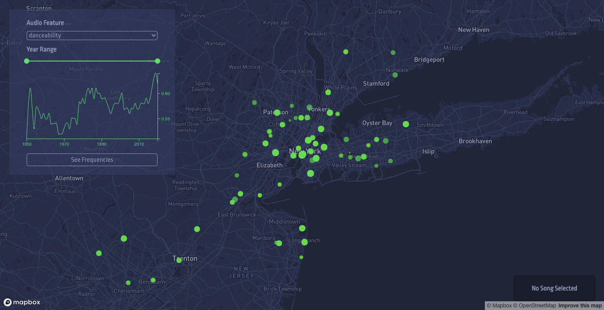
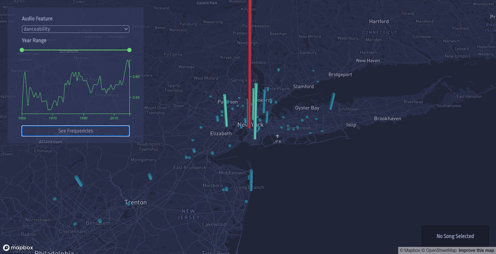
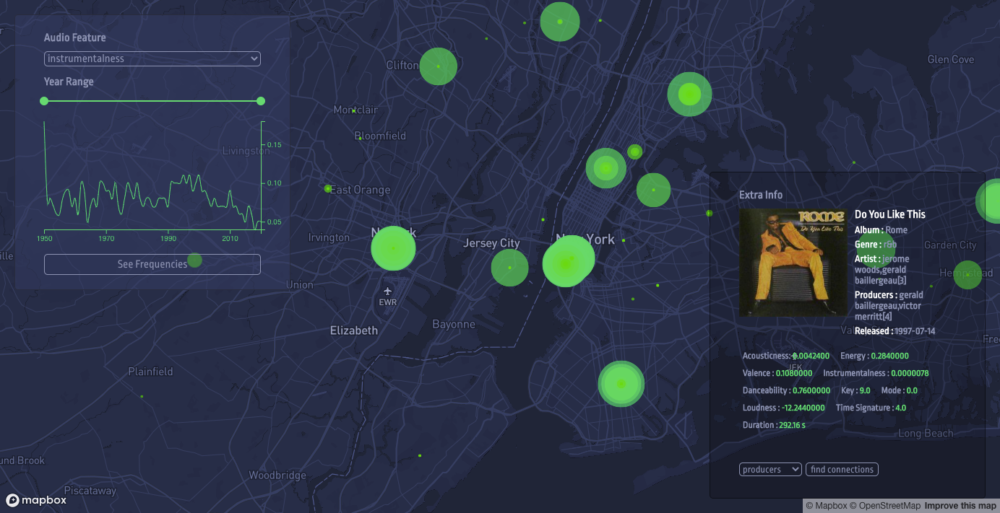

# Song Attributes Visualizer #

A visualization of all songs on Wikipedia with their song attributes collected from the Spotify API along with their frequencies at the artists' primary location queried from a postgreSQL database

Start with "npm run dev" in the react-postgres folder

